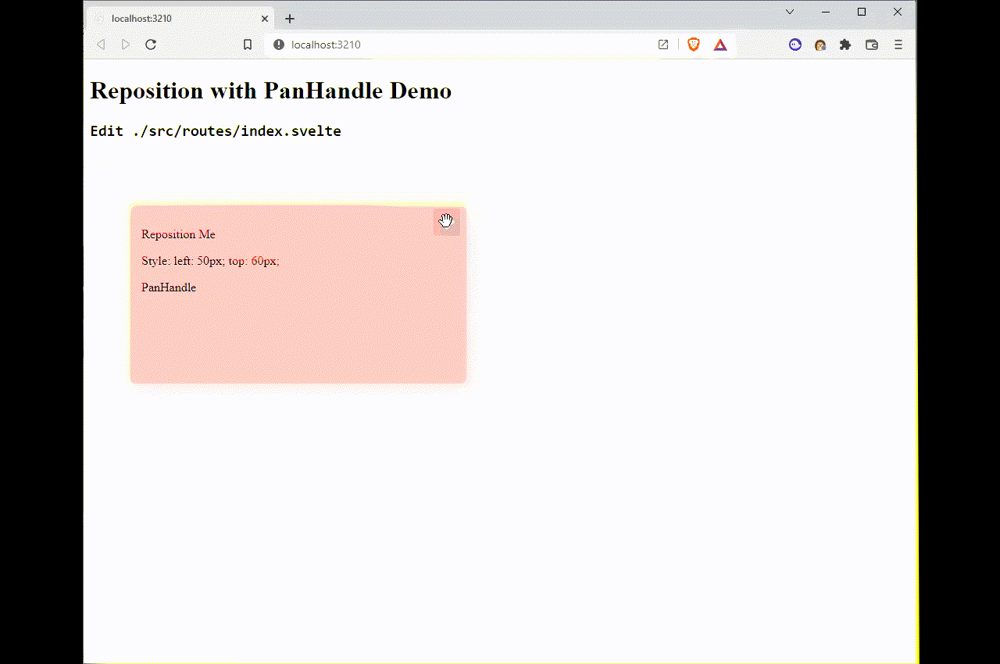

# Svelte PanHandle

Move you DOM node with a pan handle component.



```svelte
<script>
	import PanHandle from '@douganderson444/svelte-panhandle';
</script>

<div style="position: relative; width: 100%; height: 100%; left: 100px;">
	<div style="position: absolute;" class="box">
		<p>Reposition Me</p>
		<PanHandle />
	</div>
</div>
```

# Use

Check out `./src/routes/index.svelte` for demo use.
